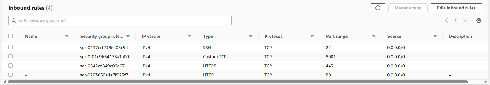

# AITU Digital Control

Digital Control is a web application built using the Django web framework that allows university staff to manage keys and track their usage. 
The application uses a MongoDB/PostgreSQL database to store key data and history.

## Features

#### Users:
- Account creation, activation via corporate (@astanait.edu.kz) email.
- Remote sending of requests for taking the key.
- View your key collection history.
- Scanning the QR code at the security for taking/returning the keys.

#### For the administrator:
###### Taking keys:
- Select an available room using an interactive map or a drop-down list.
- Generating a QR code to confirm taking the key or entering data manually.
###### Return of keys:
- Generating a QR code to receive all active user requests or manually searching for an application.
###### History:
- View the entire history of key collection with detailed information.
- Downloading the entire history to an Excel file.

###### Interactive map:
- View information about each room (status, visibility, description, etc.)
- The ability to edit and add new rooms without having to change the code.

###### Other:
- View data about all registered users.
- Locking the admin panel with a one-time PIN.
- Change the administrator password through the appropriate form.
- Tracking of active applications for taking the key in notifications in the upper navbar.
- Separation of access *(users cannot go to the admin pages and vice versa)*

## Requirements

To run Digital Control on your local machine, you will need to have the following software installed:

- Python 3.9
- Django 3.2.16
- MongoDB/PostgreSQL

## Installation

1. Clone the *Digital Control* repository to your local machine
2. Create a virtual environment for the project and activate it `source venv/Scripts/activate`
3. Install the project dependencies using `pip install -r requirements.txt`
4. Set up the PostgreSQL or MongoDB database and add the credentials to the `settings.py` file
5. Also configure the SMTP server in the `settings.py`
6. Run the Django migrations to create the necessary database tables: `python manage.py migrate`
7. Start the development server: `python manage.py runserver`

### If DEBAG = False:
7. Collect all static files using `python manage.py collectstatic`
8. Run the server using Daphne `daphne -b 0.0.0.0 -p 8020 AITUDC.asgi:application`

## Usage

Once the development server is running, you can access **Digital Control** by navigating to `http://localhost:8000/` in your web browser. The application provides separate views for staff and admin users, accessible via the navigation bar.

## Contributing

If you would like to contribute to Digital Control, please follow these steps:

1. Fork the repository to your own GitHub account.
2. Create a new branch for your feature or bug fix.
3. Write tests to cover any changes or additions.
4. Implement your feature or bug fix.
5. Ensure all tests pass.
6. Submit a pull request with your changes.

## Migrations settings
1. Создать БД. 
2. Настроить DATABASES в ```settings.py```. 
3. Закомментировать ```urls.py```
4. ```python manage.py migrate```
5. Закомментить в settings всё кроме user ``python manage.py makemigrations user``
6. Откомментить в settings. ``python manage.py makemigrations``
7. ``python manage.py migrate``
8. Откомментировать ```urls.py```
9. ```python manage.py makemigrations```
10. ```python manage.py migrate```
11. Настройка ```main/middleware.py```: Закомментировать middleware в ```settings.py```
12. Создать суперюзера ```python manage.py createsuperuser```
13. Запустить проект ```python manage.py runserver```
14. Открыть панель администратора и произвести все настройки: 
```KeyTakerSettings```, ```KeyReturnerSettings```, ```PIN```, ```Role```.


## Перед установкой 
(https://www.youtube.com/watch?v=PzSUOyshA6k)
(https://habr.com/ru/articles/546778/)
(https://www.digitalocean.com/community/tutorials/how-to-set-up-django-with-postgres-nginx-and-gunicorn-on-ubuntu-18-04#step-10-configure-nginx-to-proxy-pass-to-gunicorn)
(https://www.linkedin.com/pulse/how-deploy-django-application-aws-ubuntu-ec2-nginx-uwsgi-yiqing-lan)
`sudo apt-get update`
`pip install -r requirements`:
`sudo apt-get install libpq-dev`


## Deploing on the server (Azure)
1. Create new Microsoft Storage User
2. Edit the MEDIA_URL in the `settings.py`
3. Edit firewall for any IP
4. Create new Azure App
5. Also edit firewall settings
6. Configure Deployment Center
7. Waiting for deployment


## AWS (nginx & gunicorn)
1. `sudo nano /etc/systemd/system/gunicorn.socket`
`[Unit]
Description=gunicorn socket

[Socket]
ListenStream=/run/gunicorn.sock

[Install]
WantedBy=sockets.target`

2. `sudo nano /etc/systemd/system/gunicorn.service`
`[Unit]
Description=gunicorn daemon
Requires=gunicorn.socket
After=network.target

[Service]
User=ubuntu
Group=www-data
WorkingDirectory=/home/ubuntu/demo-AITU-DC/
ExecStart=/home/ubuntu/demo-AITU-DC/venv/bin/gunicorn \
          --access-logfile - \
          --workers 3 \
          --bind unix:/run/gunicorn.sock \
          AITUDC.wsgi:application

[Install]
WantedBy=multi-user.target`

3. `sudo nano /etc/nginx/sites-available/AITUDC`
`server {
    listen 80;
    server_name 54.93.192.225;

    location = /favicon.ico { access_log off; log_not_found off; }
    location /static/ {
        root /home/ubuntu/demo-AITU-DC/;
    }

    location /media/ {
        root /home/ubuntu/demo-AITU-DC/;
    }

    location / {
        include proxy_params;
        proxy_pass http://unix:/run/gunicorn.sock;
    }
}`

4. `sudo nano /etc/nginx/nginx.conf`
`user ubuntu;`

5 `websockets settings ...`
`[Unit]
Description=Daphne ASGI Server
After=network.target

[Service]
User=ubuntu                              
Group=www-data
WorkingDirectory=/home/ubuntu/demo-AITU-DC
ExecStart=/home/ubuntu/demo-AITU-DC/venv/bin/daphne -u /run/daphne.sock --fd 0 --access-log /var/log/daphne.log myp>
Restart=always

[Install]
WantedBy=multi-user.target`

## License

Digital Control is released under the [MIT License](https://github.com/fedenko03/DC/blob/add-license/LICENSE).
